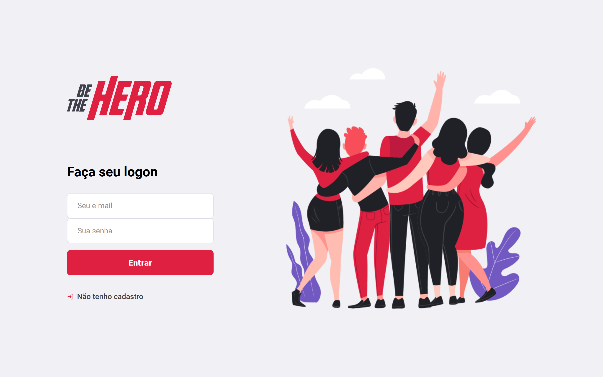
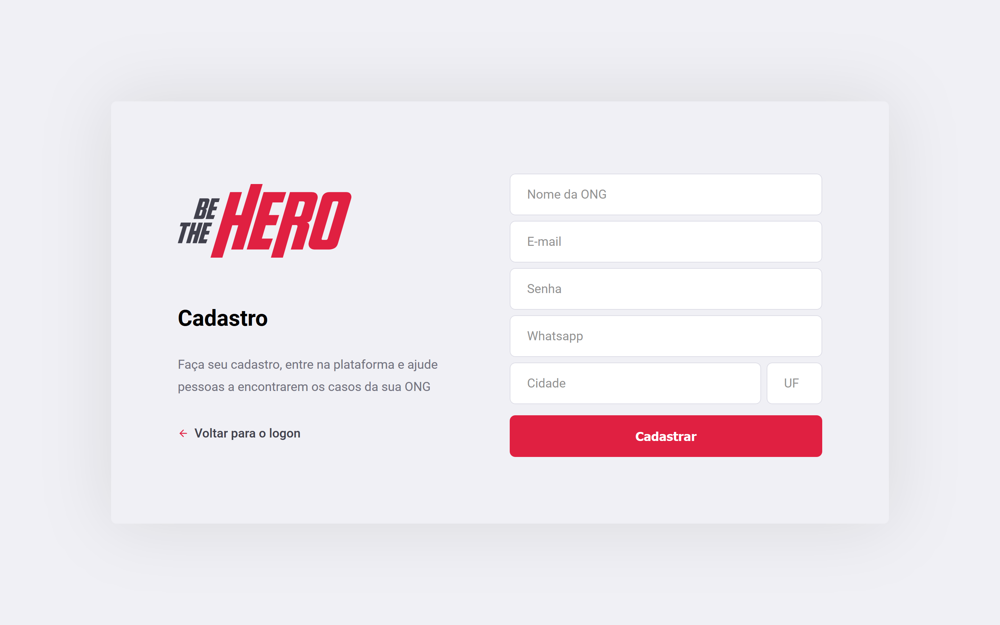
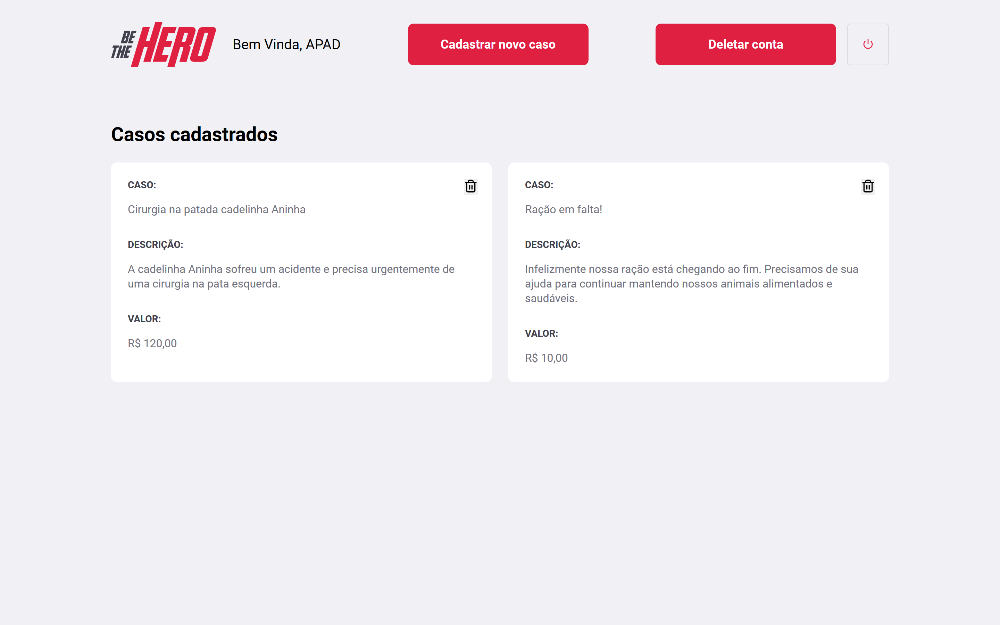
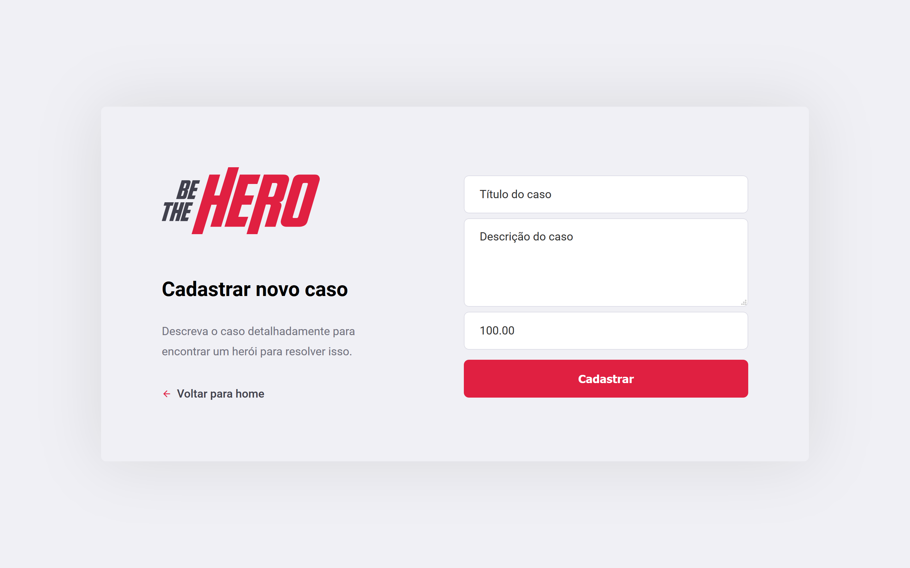
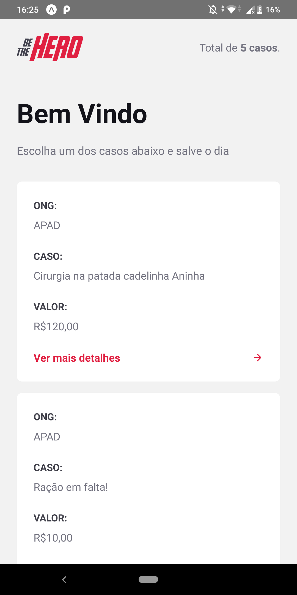
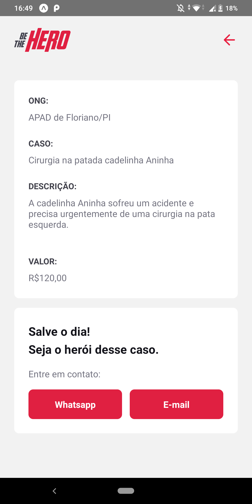

# BeTeHero

O BeTheHero é um aplicativo desenvolvido com NodeJs(backend), ReactJs(frontend) e ReactNative(Mobile), e foi desenvolvido durante a Semana Omnistack 11.

Be The Hero, tem como principal objetivo, facilitar doações para as ONGS que não possuem fundos monetários, com ele, uma ONG se cadastra e cria um caso, onde irá detalhar sobre o mesmo dando um nome, descrição e valor desejado. A partir disso qualquer pessoa com o Be The Hero, pode visualizar o caso e ajudar a ONG.

Para fins de melhorar o estudo, mudei o sistema de login, que antes era efetuado através do ID da ONG - Que é gerado pelo próprio banco de dados. Isso dificulta o login, além de ser "feio". Então para tentar melhorar isso, mudei o sistema de login para ser efetuado com um usuário e senha da ONG.

## O QUE FOI APRENDI DURANTE A SEMANA OMNISTACK?

- Melhorei o conceito de rotas e recursos.
- Melhorei o conceito e prática sobre métodos HTTP.
- Melhorei o conceito e prática sobre os tipos de parâmetros.
- Introdução ao ReactJs
- Intodução ao ReactNative
- Aplicação de comunicação entre backend e frontend
- Melhoria na visualização e resolução de problemas
- Melhoria na organização de arquivos e pastas do projeto

#### Ferramentas e tecnologias utilizadas:
    - [Knex](http://knexjs.org/), query builder
    - SQLite, banco de dados simples e pequeno
    - NodeJs, para a construição do backend
    - ReactJs, para a construção da página web
    - Reactnative, para a construção do app mobile
    - Insomnia, para o teste com as rotas do backend
    - Expo, para funcionalidades nativas do mobile
    - Celebrate, para validar os dados
    - Entre outros.

## SOBRE O APP
    * Funcionalidades
        - Login da ONG
        - Cadastro da ONG
        - Logout da ONG
        - Listagem dos casos (específicos da ONG)
        - Listagem de todos os casos
        - Cadastro de novo caso
        - Deleção do caso
        - Entrar em contato com a ONG

### PARA RODAR O APP

1. Dê um git clone

No backend
``npm start``

- Seu backend estará funcionando

No frontend
``yarn start``

- Irá abrir no ``localhost:3333``

No mobile
``yarn start``

- Irá abrir no seu navegador com um QR-CODE para você abrir no seu smartphone.

- Mas, antes. No seu smatphone instale o app ``expo`` em seguida abra ele e use o QR-CODE para rodar o app em seu smartphone.

### PRINTS DE TELA

[Jarod Cavalcante](https://github.com/jarodsim) - 2020
